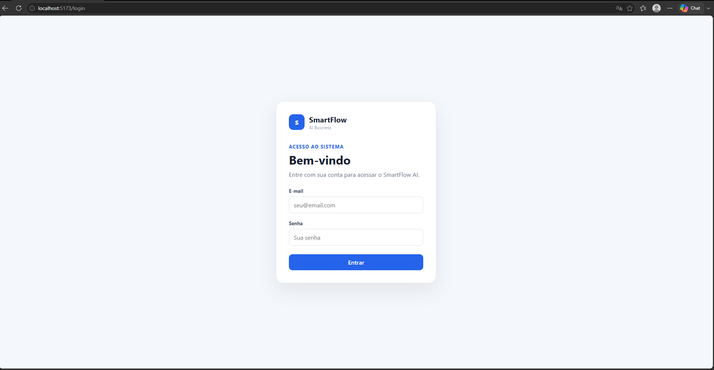
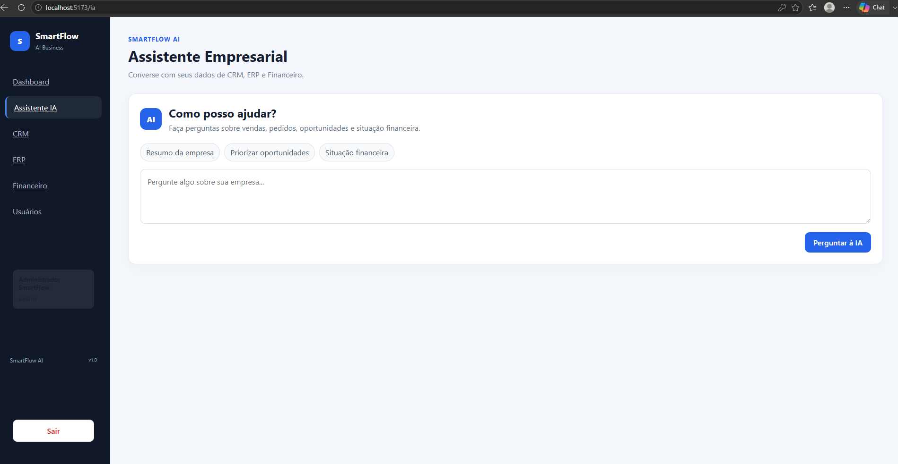
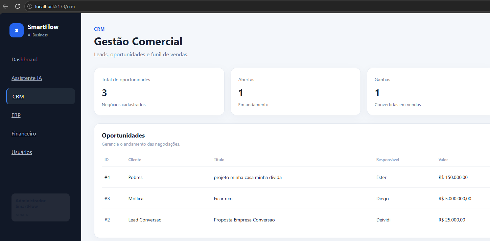
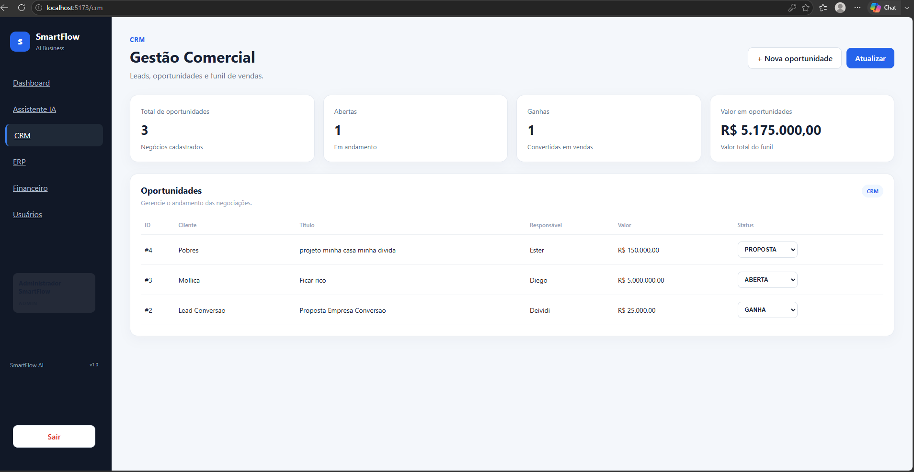
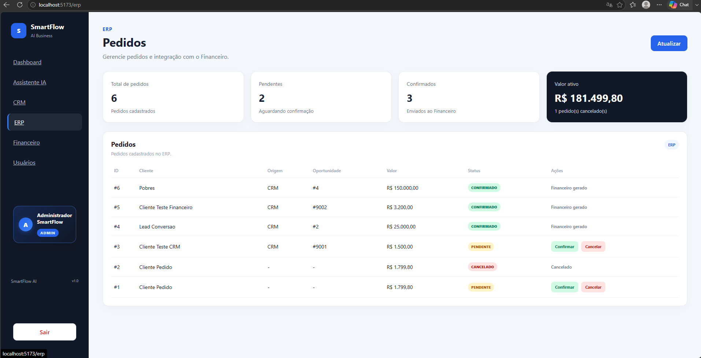
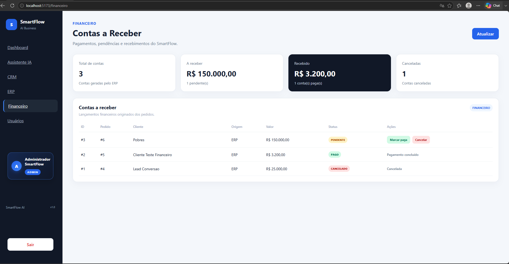
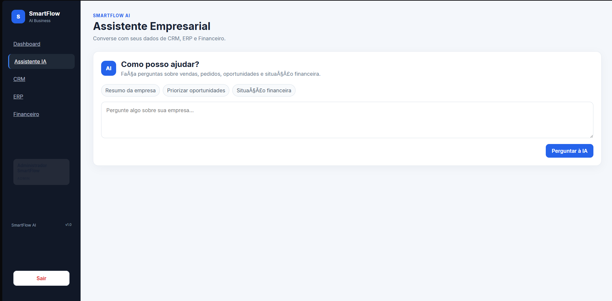

# SmartFlow AI

Plataforma empresarial Full-Stack baseada em microsserviços, integrando CRM, ERP, Financeiro, autenticação, controle de usuários e Inteligência Artificial.

## Funcionalidades

- Dashboard empresarial
- Login com JWT
- Controle de acesso por perfil
- CRM de oportunidades
- ERP de pedidos
- Financeiro e contas a receber
- Integração CRM → ERP → Financeiro
- Assistente empresarial com IA
- Administração de usuários
- Ativação e desativação de contas
- API Gateway
- Inicialização automatizada

## Perfis

| Perfil | CRM | ERP | Financeiro | IA | Usuários |
|---|---|---|---|---|---|
| ADMIN | Sim | Sim | Sim | Sim | Sim |
| VENDEDOR | Sim | Não | Não | Sim | Não |
| ATENDENTE | Sim | Sim | Não | Não | Não |

## Arquitetura

Frontend React  
↓  
API Gateway :3000  
├── Auth Service :3001  
├── CRM Service :3002  
├── ERP Service :3003  
├── Finance Service :3004  
└── AI Service :3005  

Frontend: :5173

## Tecnologias

**Frontend:** React, TypeScript, Vite, React Router, CSS

**Backend:** Node.js, TypeScript, Express, Prisma ORM, PostgreSQL, JWT e bcrypt

**IA:** OpenAI API integrada aos dados de CRM, ERP e Financeiro

**Infraestrutura:** Docker, Git e GitHub

## Segurança

- Autenticação JWT
- Autorização por perfil
- Senhas armazenadas com hash
- Microsserviços protegidos pelo Gateway
- Bloqueio de usuários inativos
- Arquivos `.env` fora do Git

## Executando

Após configurar os arquivos `.env`:

    .\SmartFlow.bat

Ou:

    powershell -ExecutionPolicy Bypass -File .\start-smartflow.ps1

Acesse:

    http://localhost:5173

## Estrutura

    smartflow-ai/
    ├── frontend/
    ├── gateway/
    ├── infra/
    ├── services/
    │   ├── ai-service/
    │   ├── auth-service/
    │   ├── crm-service/
    │   ├── erp-service/
    │   └── finance-service/
    ├── SmartFlow.bat
    └── start-smartflow.ps1

## Status

MVP funcional.

## Autor

**Deividi Luccas**  
Desenvolvedor Full-Stack  
GitHub: DeividiLuccasdev

## Demonstração

### Dashboard

### CRM

### ERP

### Financeiro

### Assistente IA

### Administração de usuários

### Login

## 🌐 Demo Online

Acesse o SmartFlow AI em produção:

https://smartflow-ai-frontend.onrender.com

> O projeto utiliza serviços gratuitos do Render. No primeiro acesso, alguns microserviços podem levar alguns segundos para iniciar.
