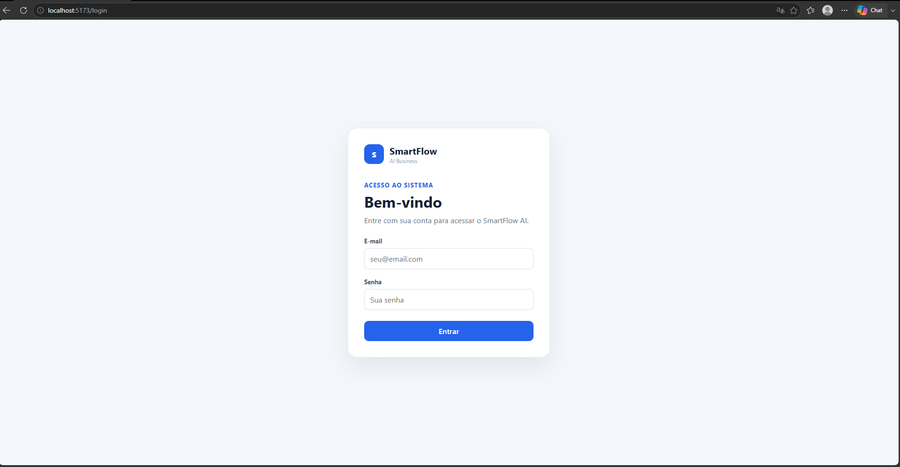
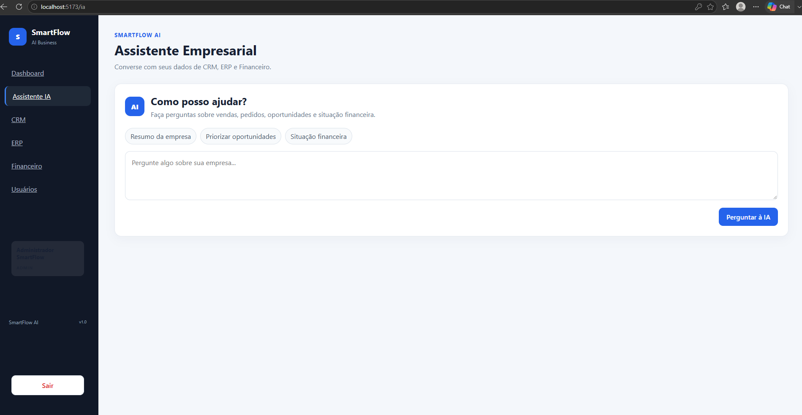
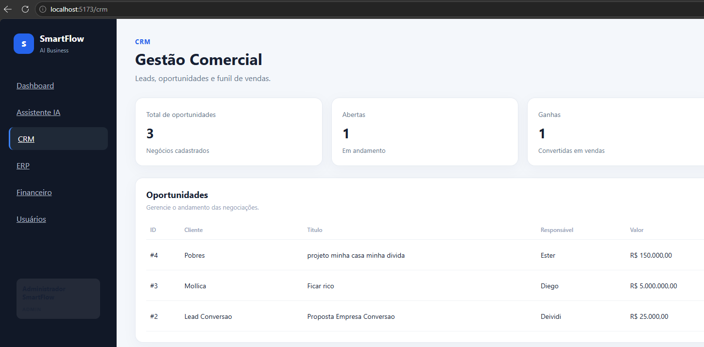
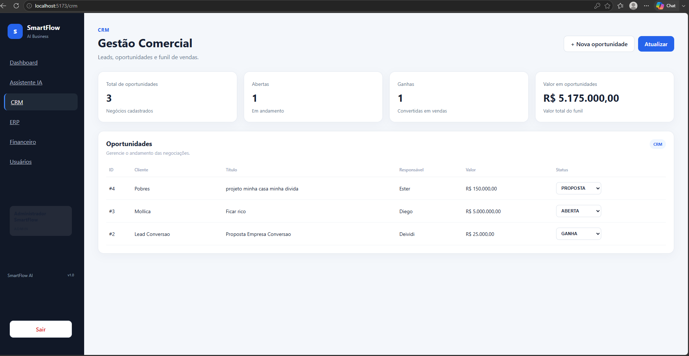
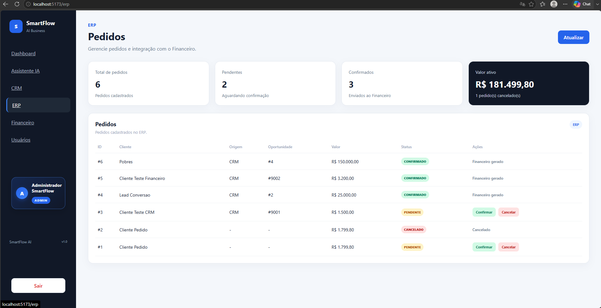
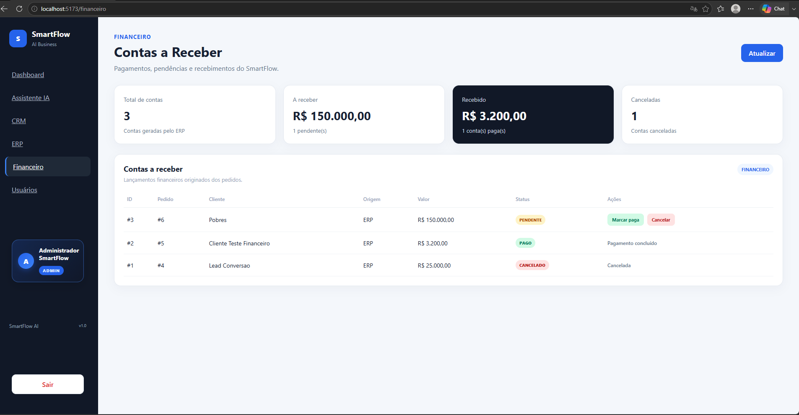
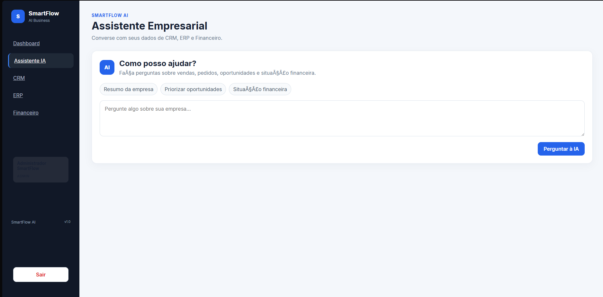

# SmartFlow AI

Plataforma empresarial Full-Stack baseada em microsserviços, integrando CRM, ERP, Financeiro, autenticação, controle de usuários e Inteligência Artificial.

## Funcionalidades

- Dashboard empresarial
- Login com JWT
- Controle de acesso por perfil
- CRM de oportunidades
- ERP de pedidos
- Financeiro e contas a receber
- Integração CRM → ERP → Financeiro
- Assistente empresarial com IA
- Administração de usuários
- Ativação e desativação de contas
- API Gateway
- Inicialização automatizada

## Perfis

| Perfil | CRM | ERP | Financeiro | IA | Usuários |
|---|---|---|---|---|---|
| ADMIN | Sim | Sim | Sim | Sim | Sim |
| VENDEDOR | Sim | Não | Não | Sim | Não |
| ATENDENTE | Sim | Sim | Não | Não | Não |

## Arquitetura

Frontend React  
↓  
API Gateway :3000  
├── Auth Service :3001  
├── CRM Service :3002  
├── ERP Service :3003  
├── Finance Service :3004  
└── AI Service :3005  

Frontend: :5173

## Tecnologias

**Frontend:** React, TypeScript, Vite, React Router, CSS

**Backend:** Node.js, TypeScript, Express, Prisma ORM, PostgreSQL, JWT e bcrypt

**IA:** OpenAI API integrada aos dados de CRM, ERP e Financeiro

**Infraestrutura:** Docker, Git, GitHub e GitHub Actions (typecheck de todos os serviços, lint e build do frontend)

## Segurança

- Autenticação JWT
- Autorização por perfil
- Senhas armazenadas com hash
- Microsserviços acessíveis somente pelo Gateway (chave interna `INTERNAL_API_KEY`)
- Usuários desativados perdem o acesso imediatamente
- Assistente de IA consulta apenas os módulos permitidos ao perfil do usuário
- Arquivos `.env` fora do Git

### Chave interna entre os serviços

Cada microsserviço recusa requisições que não tragam o cabeçalho `x-internal-key`
com o valor de `INTERNAL_API_KEY`. Só o Gateway e os próprios serviços conhecem
essa chave, então as URLs públicas dos serviços não podem ser usadas para
contornar o login. A rota `GET /` continua aberta, pois é usada para acordar os
serviços no Render.

Defina a **mesma** `INTERNAL_API_KEY` no `.env` do Gateway e de todos os serviços
(e nas variáveis de ambiente de cada serviço no Render). Para gerar uma chave:

    openssl rand -hex 32

## Executando

Suba os bancos de dados (Auth, CRM, ERP e Financeiro):

    docker compose -f infra/docker-compose.yml up -d

Crie os arquivos `.env` a partir dos `.env.example` de cada pasta e aplique as migrações
em cada serviço com `npm run migrate`. Depois:

    .\SmartFlow.bat

Ou:

    powershell -ExecutionPolicy Bypass -File .\start-smartflow.ps1

Acesse:

    http://localhost:5173

## Estrutura

    smartflow-ai/
    ├── frontend/
    ├── gateway/
    ├── infra/
    ├── services/
    │   ├── ai-service/
    │   ├── auth-service/
    │   ├── crm-service/
    │   ├── erp-service/
    │   └── finance-service/
    ├── SmartFlow.bat
    └── start-smartflow.ps1

## Status

MVP funcional.

## Autor

**Deividi Luccas**  
Desenvolvedor Full-Stack  
GitHub: DeividiLuccasdev

## Demonstração

### Dashboard

### CRM

### ERP

### Financeiro

### Assistente IA

### Administração de usuários

### Login

## 🌐 Demo Online

Acesse o SmartFlow AI em produção:

https://smartflow-ai-frontend.onrender.com

> O projeto utiliza serviços gratuitos do Render. No primeiro acesso, alguns microserviços podem levar alguns segundos para iniciar.
